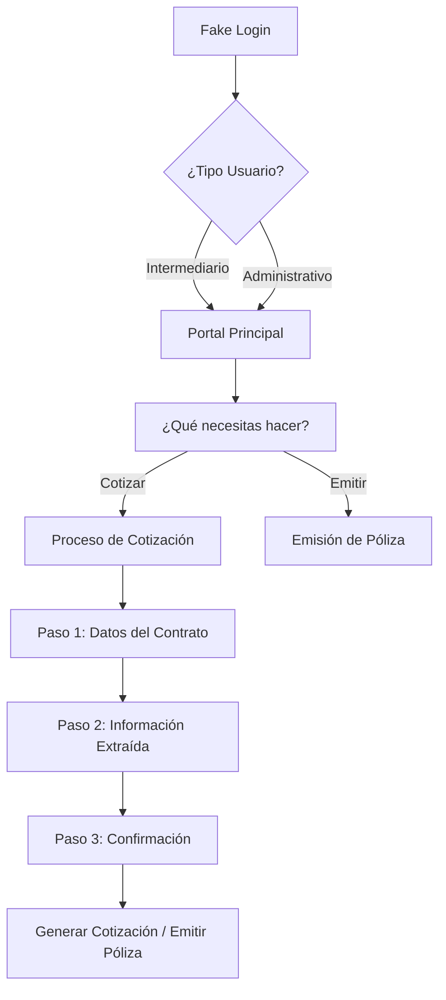

<p align="center">
  
</p>

<h1 align="center">🏛️ Portal de Cumplimiento - Frontend</h1>

<p align="center">
  <strong>Sistema de gestión de pólizas de cumplimiento para Seguros Bolívar</strong>
</p>

<p align="center">
  
  
  
  
</p>

<p align="center">
  <a href="https://browser-lyart-one.vercel.app">🌐 Ver Demo en Vivo</a>
</p>

---

## 📋 Descripción

El **Portal de Cumplimiento** es una aplicación web moderna desarrollada para **Seguros Bolívar** que permite la gestión integral de pólizas de cumplimiento. El sistema facilita los procesos de cotización, emisión y administración de pólizas con una interfaz intuitiva y profesional.

### ✨ Características Principales

- 🔐 **Autenticación Fake Login** - Simulación de ingreso para ambientes de desarrollo
- 📝 **Cotización de Pólizas** - Proceso guiado en 3 pasos
- 📄 **Emisión de Pólizas** - Conversión de cotizaciones a pólizas activas
- 📊 **Gestión de Coberturas** - Tablas de Cumplimiento y Responsabilidad Civil (RC)
- 💰 **Liquidación de Primas** - Cálculo automático con detección de cambios
- 📱 **Diseño Responsive** - Optimizado para móvil, tablet y desktop
- 🎨 **UI Corporativa** - Colores y estilos oficiales de Seguros Bolívar

---

## 🎨 Paleta de Colores Corporativos

| Color | Hex | Uso |
|-------|-----|-----|
| 🟢 Verde Bolívar | `#038450` | Color primario, textos destacados |
| 🟡 Amarillo Bolívar | `#FFE16F` | Botones de acción, highlights |
| ⬜ Blanco | `#FFFFFF` | Fondos, cards |
| 🟢 Verde Claro | `#E5F4EE` | Fondos suaves, estados validados |

---

## 🚀 Tecnologías

| Tecnología | Versión | Descripción |
|------------|---------|-------------|
| **Angular** | 20.0.0 | Framework principal |
| **TypeScript** | 5.6.0 | Lenguaje de programación |
| **Tailwind CSS** | 3.4.0 | Framework de estilos utilitarios |
| **SCSS** | - | Preprocesador CSS |
| **Font Awesome** | 6.x | Iconografía |
| **Vercel** | - | Plataforma de despliegue |

---

## 📁 Estructura del Proyecto

```
src/
├── app/
│   ├── containers/           # Componentes principales (páginas)
│   │   ├── fake-login/       # Página de login simulado
│   │   ├── policy-input/     # Cotización y emisión de pólizas
│   │   ├── portal/           # Portal principal
│   │   ├── dashboard/        # Panel de control
│   │   └── ...
│   │
│   ├── shared/               # Componentes compartidos
│   │   ├── components/       # Header, Footer, Loader, etc.
│   │   └── services/         # Servicios comunes
│   │
│   ├── core/                 # Módulos core
│   │   └── services/         # Servicios singleton
│   │
│   └── app-routing.module.ts # Configuración de rutas
│
├── assets/                   # Recursos estáticos
│   ├── css/                  # Estilos globales
│   ├── images/               # Imágenes
│   └── fonts/                # Fuentes (Nunito Sans)
│
├── styles.scss               # Estilos globales
├── styles-responsive.scss    # Sistema responsive
└── vercel.json               # Configuración de Vercel
```

---

## 🛠️ Instalación

### Prerrequisitos

- **Node.js** >= 20.x
- **npm** >= 10.x
- **Angular CLI** >= 20.x

### Pasos de Instalación

```bash
# 1. Clonar el repositorio
git clone https://github.com/caiglesiasdesarrollador-Cumplimiento/Frontend-NuevoPortalCumplimiento.git

# 2. Entrar al directorio
cd Frontend-NuevoPortalCumplimiento

# 3. Instalar dependencias
npm install

# 4. Iniciar servidor de desarrollo
ng serve --port 4200

# 5. Abrir en el navegador
# http://localhost:4200
```

---

## 📜 Scripts Disponibles

| Comando | Descripción |
|---------|-------------|
| `npm start` | Inicia el servidor de desarrollo |
| `ng serve --port 4201` | Servidor en puerto específico |
| `ng build` | Compila para desarrollo |
| `ng build --configuration=production` | Compila para producción |
| `ng test` | Ejecuta pruebas unitarias |
| `ng lint` | Analiza el código |

---

## 🌐 Despliegue

### Vercel (Producción)

```bash
# Compilar para producción
ng build --configuration=production

# Ir a la carpeta de distribución
cd dist/browser

# Desplegar a Vercel
vercel --prod --yes
```

**URL de Producción:** [https://browser-lyart-one.vercel.app](https://browser-lyart-one.vercel.app)

---

## 📱 Flujo de la Aplicación



---

## 📊 Módulos Principales

### 1. 🔐 Fake Login
Simula el ingreso de usuarios para ambientes de desarrollo/pruebas.

**Campos:**
- Tipo de documento (CC, NIT, CE, PP, PE)
- Número de documento
- Nombre completo
- Tipo de usuario (Intermediario/Administrativo)
- Clave de intermediación
- Correo electrónico

### 2. 📝 Policy Input (Cotización/Emisión)
Proceso guiado de 3 pasos para cotizar y emitir pólizas.

**Paso 1:** Selección de producto, carga de contrato, datos del tomador/asegurado

**Paso 2:** Visualización de datos extraídos del contrato (OCR simulado)

**Paso 3:** Confirmación y resumen de la cotización/póliza

### 3. 📊 Tablas de Coberturas

#### Coberturas de Cumplimiento
- Selección múltiple de coberturas
- Edición de valores asegurados
- Porcentaje de amparado
- Cálculo automático de primas

#### Coberturas RC (Responsabilidad Civil)
- Cobertura principal: 222- PREDIOS LABOR Y OPERACIO
- Deducibles configurables
- Tasa y prima calculadas
- Liquidación exclusiva para cobertura 222

---

## 🔧 Configuración de Ambiente

### Variables de Entorno

```typescript
// environment.ts
export const environment = {
  production: false,
  apiUrl: 'https://api.segurosbolivar.com/cumplimiento',
  version: '1.0.0'
};
```

### Configuración de Vercel

```json
// vercel.json
{
  "rewrites": [
    { "source": "/(.*)", "destination": "/index.html" }
  ]
}
```

---

## 🧪 Testing

```bash
# Ejecutar pruebas unitarias
ng test

# Ejecutar pruebas con cobertura
ng test --code-coverage

# Ejecutar pruebas e2e
ng e2e
```

---

## 📝 Convenciones de Código

### Nomenclatura
- **Componentes:** PascalCase (`PolicyInputComponent`)
- **Servicios:** PascalCase con sufijo Service (`AuthService`)
- **Archivos:** kebab-case (`policy-input.component.ts`)
- **Variables:** camelCase (`valorAsegurado`)
- **Constantes:** UPPER_SNAKE_CASE (`MAX_FILE_SIZE`)

### Estructura de Componentes
```typescript
@Component({
  selector: 'app-nombre-componente',
  templateUrl: './nombre-componente.component.html',
  styleUrls: ['./nombre-componente.component.scss']
})
export class NombreComponenteComponent implements OnInit {
  // Propiedades
  // Constructor
  // ngOnInit
  // Métodos públicos
  // Métodos privados
}
```

---

## 👥 Equipo de Desarrollo

| Rol | Responsabilidad |
|-----|-----------------|
| **Frontend Developer** | Desarrollo de componentes Angular |
| **UI/UX Designer** | Diseño de interfaces y experiencia |
| **QA Engineer** | Pruebas y aseguramiento de calidad |
| **Tech Lead** | Arquitectura y decisiones técnicas |

---

## 📄 Licencia

Este proyecto es propiedad de **Seguros Bolívar S.A.** y está protegido por derechos de autor. 
Uso interno exclusivo.

---

## 📞 Contacto

**Seguros Bolívar S.A.**
- 🌐 [www.segurosbolivar.com](https://www.segurosbolivar.com)
- 📧 soporte@segurosbolivar.com

---

<p align="center">
  <strong>Desarrollado con ❤️ para Seguros Bolívar</strong>
</p>

<p align="center">
  
</p>
